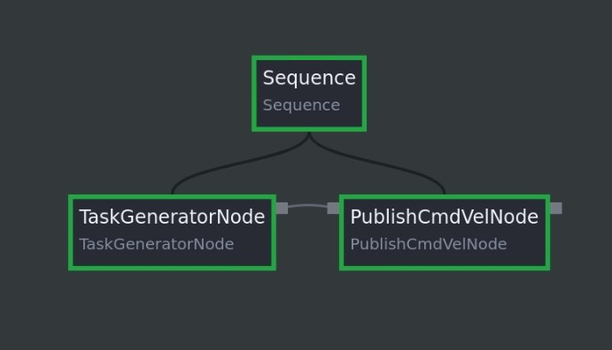

If you have multiple nodes placed side by side without a parent-child relationship, the Behavior Tree structure won't work as intended. Every Behavior Tree must have a single root node, and all other nodes must be connected (directly or indirectly) under that root.

Here’s what you need to do:

1. **Ensure a Single Root Node**  
   You need exactly one node at the top level, which serves as the root of your tree. All other nodes must be children of it or descendants further down the line. The root node is the one that gets ticked by the tree execution logic. If you simply place `TaskGeneratorNode` and `PublishCmdVelNode` side by side with no connection, the engine treats them as separate roots, which is not allowed.



2. **Use a Control Node as a Root (e.g., Sequence)**  
   One common approach is to use a control node (like `Sequence` or `Fallback`) as the root. For example, you could have:
   - A `Sequence` node as the root.
   - `TaskGeneratorNode` as the first child.
   - `PublishCmdVelNode` as the second child.

   This creates a single chain:
   ```
   Sequence
    ├─ TaskGeneratorNode
    └─ PublishCmdVelNode
   ```

3. **Wire the Data Between Nodes**  
   After you have a control node structure, you need to connect the data outputs from `TaskGeneratorNode` to the inputs of `PublishCmdVelNode`. For example:
   - `TaskGeneratorNode.outputs['task']` → `PublishCmdVelNode.inputs['task']`

   Make sure these data connections are set in the web interface’s "Data Wiring" panel so that the second node receives the correct input once the first node finishes.

4. **Ticking the Tree**  
   With a single root (for example, `Sequence`) and the nodes properly placed as children, when you start ticking the tree:
   - The `Sequence` node ticks `TaskGeneratorNode`.
   - `TaskGeneratorNode` succeeds and outputs `"success"` as `task`.
   - The `Sequence` then ticks `PublishCmdVelNode`.
   - `PublishCmdVelNode` reads the `"success"` input and starts publishing `cmd_vel`.

5. **Avoid Floating Nodes**  
   If you have nodes sitting by themselves with no parent connection, they will not be part of the executed tree. They will remain IDLE because no parent is ticking them, and thus they never get a chance to perform their actions.

**In summary:**  
You must structure your tree so that there is a single root node and all other nodes connect beneath it. Typically, use a control node (like `Sequence`) as the root, place `TaskGeneratorNode` as its first child, and `PublishCmdVelNode` as its second child. Then wire their data outputs/inputs accordingly. This ensures that when the tree is ticked, the tasks flow from the top node to the bottom node.